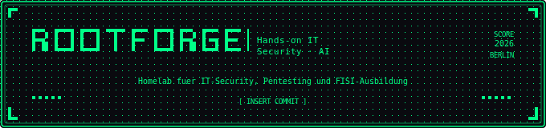

  

> Homelab für IT-Security, Pentesting und FISI-Ausbildung. Praxisnah, dokumentiert, open source.

---

## Geräte

| Gerät | OS | Rolle |
|---|---|---|
| Tower (RTX 3070, 32GB RAM) | Nobara KDE 43 (Linux) | Gaming, Alltag, KI-Gehirn |
| Raspberry Pi 5 (8GB RAM) | Kali Linux | Hacking Station, Server |
| mentat-ai-node (RPi 5 + Hailo-10H) | Raspberry Pi OS Lite | Lokaler AI-Node, Mentat-Körper |
| Huawei Laptop | Windows 11 + Kali Live USB | Schule, FISI, Pentesting |
| QNAP TS-216G | QTS 5.2 | NAS, Backup, RAID 1 |

---

## Inhalt

- [Raspberry Pi Setup](./raspberry-pi/)
  - [Kali Linux Grundsetup](./raspberry-pi/kali-setup.md)
  - [Samba Netzwerkfreigabe](./raspberry-pi/samba.md)
  - [Tailscale VPN](./raspberry-pi/tailscale.md)
  - [Pwnagotchi & Bettercap](./raspberry-pi/pwnagotchi-bettercap.md)
  - [Offline KI & Tor](./raspberry-pi/offline-ki-tor.md)
  - [mentat-ai-node Setup](./raspberry-pi/mentat-ai-node.md)
- [Tower Setup](./windows-tower/)
  - [Nobara KDE 43 (aktuell)](./windows-tower/nobara-setup.md)
  - [Windows 11 Setup (veraltet)](./windows-tower/windows-tower-veraltet.md)
- [Networking](./networking/)
  - [Heimnetz Übersicht](./networking/heimnetz-setup.md)
- [DVWA Übungen](./dvwa/)
  - [Brute Force — Burp Suite Intruder](./dvwa/dvwa-brute-force.md)
  - [SQL Injection — manueller Dump & Hash Cracking](./dvwa/dvwa-sqli.md)
- [Eigene Projekte](./eigene-projekte/)
  - [Nextcloud auf Ubuntu 24.04](./eigene-projekte/nextcloud/nextcloud-setup.md)
  - [N8N CVE Monitor](./eigene-projekte/cve-monitor/n8n-cve-monitor.md)
  - [Mentat Network Monitor](./eigene-projekte/network-monitor/n8n-network-monitor.md)
    - [network-monitor.sh — Shell Skript](./eigene-projekte/network-monitor/network-monitor.sh)
  - [Mentat — Persönlicher Offline-KI-Assistent](./eigene-projekte/mentat-ai/README.md)
    - [BUILDING.md — Der Weg dorthin](./eigene-projekte/mentat-ai/BUILDING.md)
    - [mentat.py — Text-Chat Script](./eigene-projekte/mentat-ai/mentat.py)
    - [mentat_voice.py — Voice-Chat Script](./eigene-projekte/mentat-ai/mentat_voice.py)
    - [mentat_text.py — Text-Chat Script für Tower](./eigene-projekte/mentat-ai/mentat_text.py)
    - [mentat_web.py — Web Interface (iPhone/Browser via Tailscale)](./eigene-projekte/mentat-ai/mentat_web.py)
  - [QNAP TS-216G Backup System](./eigene-projekte/qnap-ts216g-backup-system/nas-setup.md)
    - [backup-tower.sh — Tower Backup Skript](./eigene-projekte/qnap-ts216g-backup-system/backup-tower.sh)
    - [backup-mentat.sh — mentat-ai-node Backup Skript](./eigene-projekte/qnap-ts216g-backup-system/backup-mentat.sh)
    - [backup-kali.sh — Kali-Pi Backup Skript](./eigene-projekte/qnap-ts216g-backup-system/backup-kali.sh)

---

## Ziel

Vorbereitung auf Praktikum bei BerlinCert (IT-Security/Pentesting) und langfristig Ethical Hacker / regulatorischer Pentester.

---

## Tools & Technologien

`Kali Linux` `Nobara Linux` `Windows Server 2025` `Docker` `N8N` `Hailo-10H` `Metasploit` `Burp Suite` `DVWA` `Tailscale` `Samba` `TryHackMe` `Bettercap` `Tor` `nmap` `arp-scan` `Ollama` `llama3.1:8b` `MemPalace` `SearXNG` `Flask` `Whisper` `Piper TTS` `openwakeword` `rsync` `QNAP QTS` `Wake-on-LAN` `Nextcloud` `Apache` `MariaDB` `Let's Encrypt`

---

> ⚠️ Dieses Repository enthält keine echten IPs, Passwörter oder sensiblen Netzwerkdaten.
