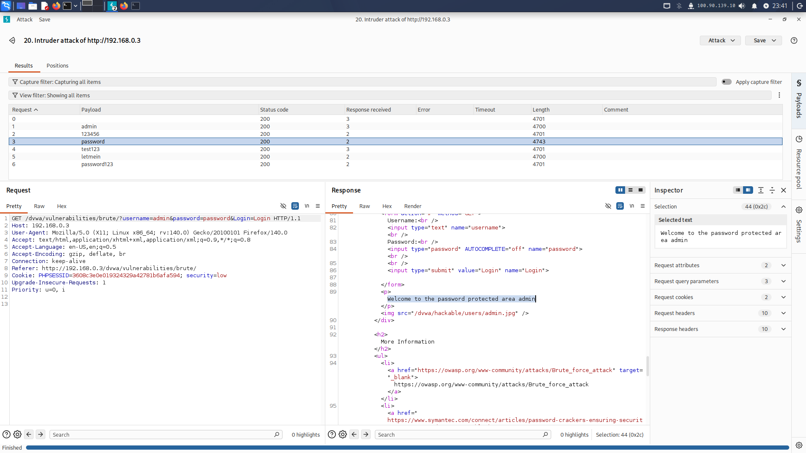

# DVWA Brute Force — Burp Suite Intruder

**Ziel:** Passwort eines Accounts durch automatisiertes Ausprobieren herausfinden  
**Tool:** Burp Suite Community Edition  
**Übungsumgebung:** DVWA auf Raspberry Pi 5, Security Level: Low

> ⚠️ Alle Tests wurden ausschließlich in der eigenen Übungsumgebung (DVWA) durchgeführt. Dieses Dokument hat reinen Lern- und Ausbildungscharakter.

---

## Voraussetzungen

- DVWA läuft auf Apache (`http://<PI-IP>/dvwa`)
- Burp Suite installiert (auf Kali vorinstalliert)
- Firefox als Browser

---

## Schritt 1 — Burp Suite starten

```bash
java -jar -Xmx1g /usr/share/burpsuite/burpsuite.jar
```

> Hinweis: Der Standard-Befehl `burpsuite` startet ohne RAM-Limit und crasht auf dem Pi. `-Xmx1g` begrenzt auf 1GB.

Beim Start: **Temporary project in memory** → Next → Start Burp

---

## Schritt 2 — Proxy einrichten

Firefox → Einstellungen → "Proxy" suchen → Manuell:

| Feld | Wert |
|---|---|
| HTTP Proxy | `127.0.0.1` |
| Port | `8080` |

---

## Schritt 3 — Request abfangen

1. In DVWA einloggen (`admin / password`)
2. Zur Übungsseite navigieren: `http://<PI-IP>/dvwa/vulnerabilities/brute/`
3. Intercept in Burp **einschalten**: Proxy → Intercept → "Intercept is on"
4. Auf der Brute-Force-Seite einen **falschen** Login abschicken (z.B. `admin / test123`)
5. Den GET-Request in Burp abfangen
6. Rechtsklick → **Send to Intruder**
7. Intercept **ausschalten**: "Intercept is off"

> Wichtig: Den Request von der Übungsseite abfangen, nicht vom DVWA-Login. Die Übungsseite nutzt GET statt POST und hat auf Low keinen CSRF-Token-Schutz.

---

## Schritt 4 — Intruder konfigurieren

### Positions Tab

1. **Clear §** klicken — alle automatischen Markierungen entfernen
2. Nur den Wert hinter `password=` markieren
3. **Add §** klicken → Ergebnis: `password=§test123§`

Unten sollte stehen: **1 payload position**

### Payloads Tab

1. Payload type: **Simple list**
2. **Load** → Wordlist auswählen

```bash
# Wordlist vorbereiten (kleine Testliste empfohlen für den Pi)
nano ~/testlist.txt
```

Inhalt:
```
admin
123456
password
test123
letmein
password123
```

> Hinweis: rockyou.txt (14 Mio. Einträge) bringt Burp Community auf dem Pi zum Absturz. Für echte Tests auf dem Pi eigene, kleinere Wordlists nutzen.

---

## Schritt 5 — Angriff starten

**Start attack** klicken → Ergebnisfenster öffnet sich.

### Treffer erkennen

Nach **Length** Spalte sortieren — das richtige Passwort hat eine **abweichende Response-Länge**:

| Payload | Length | Ergebnis |
|---|---|---|
| admin | 4700 | Falsches Passwort |
| 123456 | 4701 | Falsches Passwort |
| **password** | **4743** | ✅ Richtiges Passwort |
| test123 | 4701 | Falsches Passwort |
| letmein | 4700 | Falsches Passwort |
| password123 | 4701 | Falsches Passwort |

`password` sticht mit **4743** klar heraus — alle anderen liegen bei 4700/4701.

### Request beim Treffer

```
GET /dvwa/vulnerabilities/brute/?username=admin&password=password&Login=Login HTTP/1.1
Host: 192.168.0.3
Cookie: PHPSESSID=3608c3e0e019324329a42781b6afa594; security=low
```

### Response beim Treffer

Auf den Treffer klicken → **Response Tab** → Zeile 89:

```html
<p>Welcome to the password protected area admin</p>
```



---

## Fehler & Fixes

### Burp crasht beim Start

```bash
java -jar -Xmx1g /usr/share/burpsuite/burpsuite.jar
```

### Alle Requests bekommen 302

Ursache: Falscher Request abgefangen (Login-Seite statt Übungsseite), oder Intercept war noch an beim Angriff.

Fix:
- Sicherstellen dass der Request von `/dvwa/vulnerabilities/brute/` kommt
- Intercept **ausschalten** bevor Start attack

### Kein Längenunterschied sichtbar

Ursache: Session-Cookie fehlt im Request.

Fix: Erst in DVWA einloggen, dann erst den Request auf der Brute-Force-Seite abfangen — der `PHPSESSID`-Cookie wird dann automatisch mitgesendet.

### Attack-Fenster öffnet sich nicht

Burp-Fenster minimieren — das Fenster öffnet sich manchmal dahinter.

---

## Lessons Learned

- Burp Intruder zeigt das Passwort nicht direkt an — man erkennt den Treffer an der abweichenden Response-Länge
- Der Session-Cookie muss im Request enthalten sein, sonst sind alle Responses identisch
- DVWA-Login und DVWA-Übungsseiten sind unterschiedliche Angriffspunkte
- Auf ressourcenschwacher Hardware (Pi) kleine Wordlists verwenden

---

## Status

- ✅ Burp Suite Proxy eingerichtet
- ✅ Request abgefangen und an Intruder gesendet
- ✅ Payload Position korrekt gesetzt
- ✅ Passwort `password` durch Response-Länge identifiziert
- ✅ Ergebnis in Response verifiziert (`Welcome to the password protected area admin`)
