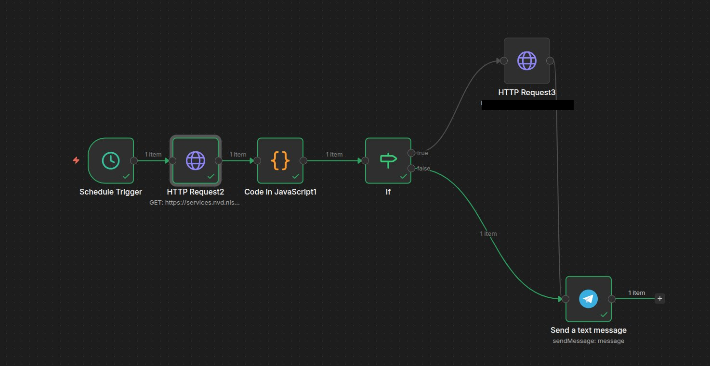

# N8N CVE Monitor


Persönlicher Security-Bot der täglich relevante CVEs filtert, per KI zusammenfasst und via Telegram meldet.

---

## Workflow



**Pipeline:**
`Schedule Trigger` → `HTTP Request (NVD API)` → `Code in JavaScript (Filter)` → `IF` → `HTTP Request (Ollama)` → `Code in JavaScript (Trim)` → `Send a text message (Telegram)`

---

## Nodes im Detail

### Schedule Trigger
- Täglich **08:00 Uhr** (Berlin)

### HTTP Request2 — NVD API
- `GET https://services.nvd.nist.gov/rest/json/cves/2.0`
- Query Parameter:
  - `pubStartDate` → `{{ $now.minus(1, 'day').toISO() }}`
  - `pubEndDate` → `{{ $now.toISO() }}`
  - `resultsPerPage` → `50`
- Kein API Key nötig, kostenlos

### Code in JavaScript1 — Filter & Aufbereitung
Filtert CVEs nach relevanten Systemen. Gibt `NONE`-Item zurück wenn nichts gefunden. CVEs ohne CVSS Score (`N/A`) werden direkt ohne Ollama an Telegram geschickt.

**Überwachte Systeme:**
- Raspberry Pi OS Lite (`raspberry`, `raspbian`, `bcm2835`, `broadcom`)
- Nobara OS (`fedora`, `nobara`, `rhel`)
- Windows (`windows 11`, `windows 10`, `microsoft windows`)
- Kali Linux / SSH / Crypto (`kali linux`, `openssh`, `openssl`)
- Linux allgemein (`systemd`, `glibc`)

**Vollständiger Code:**
```javascript
const data = $input.first().json;
const vulns = data.vulnerabilities || [];

const keywords = [
  'raspberry', 'raspbian', 'bcm2835', 'broadcom',
  'fedora', 'nobara', 'rhel',
  'windows 11', 'windows 10', 'microsoft windows',
  'kali linux', 'openssh', 'openssl',
  'systemd', 'glibc'
];

if (vulns.length === 0) {
  return [{
    json: {
      id: 'NONE',
      description: 'Heute keine CVEs in den letzten 24h veröffentlicht. Alles ruhig.',
      published: new Date().toISOString(),
      score: 'N/A'
    }
  }];
}

const relevant = vulns.filter(v => {
  const desc = (v.cve.descriptions || [])
    .find(d => d.lang === 'en')?.value?.toLowerCase() || '';
  return keywords.some(kw => {
    if (['debian', 'kali', 'fedora'].includes(kw)) {
      return new RegExp('\\b' + kw + '\\b').test(desc);
    }
    return desc.includes(kw);
  });
});

if (relevant.length === 0) {
  return [{
    json: {
      id: 'NONE',
      description: 'Heute nichts für dich dabei — keine relevanten CVEs für deine Systeme gefunden. Genieß den Tag! 🟢',
      published: new Date().toISOString(),
      score: 'N/A'
    }
  }];
}

return relevant.slice(0, 3).map(v => {
  const cve = v.cve;
  const id = cve.id;
  const description = ((cve.descriptions || []).find(d => d.lang === 'en')?.value || 'No description')
    .replace(/[\r\n\t]/g, ' ')
    .replace(/"/g, "'");
  const published = cve.published;

  const cvssV31 = cve.metrics?.cvssMetricV31?.[0]?.cvssData;
  const cvssV30 = cve.metrics?.cvssMetricV30?.[0]?.cvssData;
  const cvss = cvssV31 || cvssV30;
  const score = cvss ? `${cvss.baseScore} (${cvss.baseSeverity})` : 'N/A';
  const skip_ollama = score === 'N/A';

  return { json: { id, description, published, score, skip_ollama } };
});
```

### IF — Relevanz-Check
- `{{ $json.id }}` is not equal to `NONE` **AND** `{{ $json.skip_ollama }}` is equal to `false`
- Convert types where required: **an**
- **true** → Ollama → Code Trim → Telegram
- **false** → direkt Telegram (kein LLM-Call)

### HTTP Request3 — Ollama (hailo-ollama)
- `POST http://<HAILO-HOST>:8000/api/chat`
- Modell: `llama3.2:3b`
- `stream: false`

**JSON Body:**
```json
{
  "model": "llama3.2:3b",
  "messages": [
    {
      "role": "system",
      "content": "Antworte NUR auf Deutsch. Genau 2 kurze Saetze. Kein Markdown."
    },
    {
      "role": "user",
      "content": "CVE {{ $json.id }} (Score: {{ $json.score }}): {{ $json.description }}\n\nWas ist das Problem und bin ich als normaler Linux-Nutzer betroffen?"
    }
  ],
  "stream": false
}
```

### Code in JavaScript — Trim & Format
Kürzt Ollama Output auf 2 Sätze, entfernt Markdown, fügt CVE ID und Score hinzu.

```javascript
const content = $input.item.json.message?.content || '';
const id = $('Code in JavaScript1').item.json.id || '';
const score = $('Code in JavaScript1').item.json.score || '';
const clean = content
  .replace(/#{1,6}\s*/g, '')
  .replace(/\*\*/g, '')
  .replace(/`[^`]*`/g, '')
  .trim();
const sentences = clean.split(/(?<=[.!?])\s+|\n+/);
const short = sentences.filter(s => s.trim().length > 10).slice(0, 2).join(' ');
const summary = String.fromCharCode(128308) + ' ' + id + ' (' + score + ')\n\n' + short;
return { json: { summary: summary } };
```

### Send a text message — Telegram
- Text: `{{ $json.summary ?? ('🔴 ' + $json.id + ' (' + $json.score + ')\n\n' + $json.description.slice(0, 300) + '...') ?? $json.message }}`
- Parse Mode: None

---

## Verhalten

| Situation | Verhalten |
|-----------|-----------|
| CVEs mit Score gefunden | Ollama fasst zusammen → gekürzt → Telegram mit ID + Score |
| CVEs ohne Score (N/A) | Direkt Telegram: ID + erste 300 Zeichen der Beschreibung |
| Keine relevanten CVEs | Direkt Telegram: „Heute nichts für dich dabei 🟢" |
| NVD API liefert nichts | Telegram: „Heute keine CVEs veröffentlicht. Alles ruhig." |

---

## Infrastruktur

| Komponente | Details |
|------------|---------|
| N8N | Docker Container auf `mentat-ai-node` |
| hailo-ollama | Nativer Prozess auf Pi, Port 8000, Hailo-8 NPU |
| Modell | `llama3.2:3b` |
| NVD API | Kostenlos, kein Account nötig |

---

## Changelog

### v2.3 — 04.04.2026 (aktuell)
- Modell gewechselt: `qwen2.5-instruct:1.5b` → `llama3.2:3b` — bessere Qualität, weniger Halluzination
- Keywords bereinigt: `debian`, `arm`, `aarch64` entfernt — verursachten False Positives in KASAN Reports
- `kali` → `kali linux` für präziseren Match
- Wortgrenze-Regex für `debian`, `kali`, `fedora` zur Absicherung

### v2.2 — 03.04.2026
- Max 3 CVEs statt 10 → kein Ollama Timeout mehr
- `skip_ollama` Flag: CVEs ohne CVSS Score gehen direkt an Telegram
- Code Trim Node: entfernt Markdown, Backticks, kürzt auf 2 Sätze
- CVE ID + Score direkt in Telegram sichtbar
- Telegram Text: mehrstufiger Fallback `summary ?? beschreibung ?? message`

### v2.1 — 02.04.2026
- `resultsPerPage` auf 50 erhöht
- Keywords bereinigt — generische Tools entfernt
- System Role im Ollama Prompt → kein Chinesisch mehr
- Sonderzeichen in Descriptions bereinigt → kein JSON-Fehler mehr

### v2.0 — 02.04.2026
- RSS Feed ersetzt durch NVD API 2.0
- XML Node entfernt
- Keyword-Filter für eigene Systeme hinzugefügt
- IF Node: Ollama wird übersprungen wenn keine relevanten CVEs
- Feedback auch bei leerem Ergebnis
- Prompt auf Deutsch, persönlicher Ton

### v1.0
- NVD RSS Feed → XML → Code (top 10 slice) → Ollama → Telegram
- Problem: alte CVEs aus RSS, LLM halluzinierte mangels echter Descriptions
