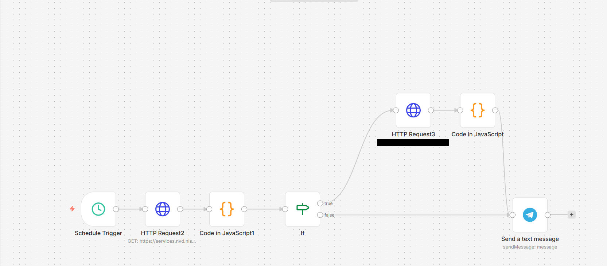

# N8N CVE Monitor


Persönlicher Security-Bot der täglich relevante CVEs filtert, per KI zusammenfasst und via Telegram meldet.

---

## Workflow



**Pipeline:**
`Schedule Trigger` → `HTTP Request (NVD API)` → `Code in JavaScript (Filter)` → `IF` → `HTTP Request (Ollama)` → `Code in JavaScript (Trim)` → `Send a text message (Telegram)`

---

## Nodes im Detail

### Schedule Trigger
- Täglich **08:00 Uhr** (Berlin)

### HTTP Request2 — NVD API
- `GET https://services.nvd.nist.gov/rest/json/cves/2.0`
- Query Parameter:
  - `pubStartDate` → `{{ $now.minus(1, 'day').toISO() }}`
  - `pubEndDate` → `{{ $now.toISO() }}`
  - `resultsPerPage` → `50`
- Kein API Key nötig, kostenlos

### Code in JavaScript1 — Filter & Aufbereitung
Filtert CVEs nach relevanten Systemen. Gibt `NONE`-Item zurück wenn nichts gefunden. CVEs ohne CVSS Score (`N/A`) werden direkt ohne Ollama an Telegram geschickt.

**Überwachte Systeme:**
- Raspberry Pi 5 (`raspberry pi`, `raspberry pi 5`, `bcm2712`, `bcm2835`)
- Kali Linux / Ubuntu / Debian (`kali linux`, `ubuntu`, `debian`)
- Windows (`windows 11`, `microsoft windows`)
- SSH / Crypto / Linux allgemein (`openssh`, `openssl`, `systemd`, `glibc`)
- Homelab-Software (`docker`, `tailscale`, `samba`, `nextcloud`, `qnap`)
- KI-Stack (`ollama`, `llama.cpp`, `qwen3`, `hailo`)

**Matching-Logik (seit v3.0):** Matcht primär gegen die strukturierten `affected[].affectedData[].vendor/product/packageName`-Felder der NVD-Response. Freitext-Suche in der Beschreibung ist nur noch Fallback, falls eine CVE keine strukturierten Produktdaten mitliefert. Vorher lief das Matching ausschließlich gegen die freie Beschreibung, was zu False Positives führte (siehe Changelog v3.0).

**Vollständiger Code:**
```javascript
const data = $input.first().json;
const vulns = data.vulnerabilities || [];

const keywords = [
  'raspberry pi', 'raspberry pi 5', 'bcm2712', 'bcm2835',
  'kali linux', 'ubuntu', 'debian',
  'windows 11', 'microsoft windows',
  'openssh', 'openssl', 'systemd', 'glibc',
  'docker', 'tailscale', 'samba', 'nextcloud', 'qnap',
  'ollama', 'llama.cpp', 'qwen3', 'hailo'
];

if (vulns.length === 0) {
  return [{
    json: {
      id: 'NONE',
      description: 'Heute keine CVEs in den letzten 24h veröffentlicht. Alles ruhig.',
      published: new Date().toISOString(),
      score: 'N/A'
    }
  }];
}

const relevant = vulns.filter(v => {
  const cve = v.cve;
  const desc = (cve.descriptions || []).find(d => d.lang === 'en')?.value?.toLowerCase() || '';

  const affectedNames = (cve.affected || [])
    .flatMap(a => a.affectedData || [])
    .flatMap(ad => [ad.vendor, ad.product, ad.packageName])
    .filter(Boolean)
    .map(s => s.toLowerCase());

  if (affectedNames.length > 0) {
    return keywords.some(kw => affectedNames.some(n => n.includes(kw)));
  }

  return keywords.some(kw => {
    if (['debian', 'kali', 'fedora'].includes(kw)) {
      return new RegExp('\\b' + kw + '\\b').test(desc);
    }
    return desc.includes(kw);
  });
});

if (relevant.length === 0) {
  return [{
    json: {
      id: 'NONE',
      description: 'Heute nichts für dich dabei — keine relevanten CVEs für deine Systeme gefunden. Genieß den Tag! 🟢',
      published: new Date().toISOString(),
      score: 'N/A'
    }
  }];
}

return relevant.slice(0, 3).map(v => {
  const cve = v.cve;
  const id = cve.id;
  const description = ((cve.descriptions || []).find(d => d.lang === 'en')?.value || 'No description')
    .replace(/[\r\n\t]/g, ' ')
    .replace(/"/g, "'");
  const published = cve.published;

  const cvssV31 = cve.metrics?.cvssMetricV31?.[0]?.cvssData;
  const cvssV30 = cve.metrics?.cvssMetricV30?.[0]?.cvssData;
  const cvss = cvssV31 || cvssV30;
  const score = cvss ? `${cvss.baseScore} (${cvss.baseSeverity})` : 'N/A';
  const skip_ollama = score === 'N/A';

  return { json: { id, description, published, score, skip_ollama } };
});
```

### IF — Relevanz-Check
- `{{ $json.id }}` is not equal to `NONE` **AND** `{{ $json.skip_ollama }}` is equal to `false`
- Convert types where required: **an**
- **true** → Ollama → Code Trim → Telegram
- **false** → direkt Telegram (kein LLM-Call)

### HTTP Request3 — Ollama (hailo-ollama)
- `POST http://<HAILO-HOST>:8000/api/chat`
- Modell: `llama3.2:3b`
- `stream: false`
- **Prompt seit v3.0 auf Englisch:** kleine 3B-Modelle liefern auf Englisch deutlich zuverlässigere, weniger halluzinierte Ergebnisse als bei gleichzeitiger Übersetzung+Zusammenfassung ins Deutsche. Prompt verbietet dem Modell zusätzlich explizit, eigene CVE-Nummern zu erfinden.

**JSON Body:**
```json
{
  "model": "llama3.2:3b",
  "messages": [
    {
      "role": "system",
      "content": "You summarize CVE descriptions in exactly 1-2 sentences. Rules: Output ONLY the summary text. No notes, no questions, no meta-commentary, no CVE numbers or IDs (they are provided separately), no markdown, no fabricated details. If the input is unclear or incomplete, summarize only what is explicitly stated. Do not ask for more information."
    },
    {
      "role": "user",
      "content": "{{ $json.description }}"
    }
  ],
  "stream": false
}
```

### Code in JavaScript — Trim & Format
Verarbeitet die Ollama-Antwort: kürzt auf den ersten Absatz, entfernt versehentlich generierte CVE-Nummern als Sicherheitsnetz gegen Halluzination, harte Längenbegrenzung als Fallback.

> **Hinweis (v3.0):** Der zuvor hier dokumentierte Code war nie tatsächlich in den Live-Workflow eingefügt worden — der reale Node enthielt versehentlich eine Kopie des Filter-Codes aus `Code in JavaScript1` und warf bei jeder Ausführung einen `ReferenceError`. Erst beim gezielten Einzeltest dieses Nodes (statt nur End-to-End-Tests) fiel das auf. Der Code unten ist der tatsächlich getestete, funktionierende Ersatz.

```javascript
const raw = $json.message.content;

// Nur den ersten Absatz behalten (schneidet Notes/Fragen nach Leerzeile ab)
let summary = raw.split(/\n\s*\n/)[0].trim();

// Sicherheitsnetz: falls das Modell trotzdem eine CVE-Nummer erfindet, rauswerfen
summary = summary.replace(/CVE-\d{4}-\d{4,7}/gi, '').trim();

// Harte Längenbegrenzung als Fallback
if (summary.length > 400) {
  summary = summary.slice(0, 400).trim() + '…';
}

// Original-Felder (id, published, score) aus dem If-Node zurückholen
const original = $('If').item.json;

return {
  json: {
    id: original.id,
    published: original.published,
    score: original.score,
    summary
  }
};
```

### Send a text message — Telegram
- Text: `{{ $json.summary ?? ('🔴 ' + $json.id + ' (' + $json.score + ')\n\n' + $json.description.slice(0, 300) + '...') ?? $json.message }}`
- Parse Mode: None

---

## Verhalten

| Situation | Verhalten |
|-----------|-----------|
| CVEs mit Score gefunden | Ollama fasst zusammen → gekürzt → Telegram mit ID + Score |
| CVEs ohne Score (N/A) | Direkt Telegram: ID + erste 300 Zeichen der Beschreibung |
| Keine relevanten CVEs | Direkt Telegram: „Heute nichts für dich dabei 🟢" |
| NVD API liefert nichts | Telegram: „Heute keine CVEs veröffentlicht. Alles ruhig." |

---

## Infrastruktur

| Komponente | Details |
|------------|---------|
| N8N | Docker Container auf `mentat-ai-node` |
| hailo-ollama | Nativer Prozess auf Pi, Port 8000, Hailo-8 NPU |
| Modell | `llama3.2:3b` |
| NVD API | Kostenlos, kein Account nötig |

---

## Changelog

### v3.0 — 28.08.2026 (aktuell)
Drei eigenständige Bugs gefunden und behoben, systematisch node-für-node einzeln getestet statt nur End-to-End:
- **False-Positive-Filter behoben:** Keyword-Matching lief bisher gegen die freie CVE-Beschreibung (`desc.includes(kw)`), nicht gegen strukturierte Produktdaten. Dadurch matchte z.B. eine TYPO3-Extension-CVE auf `openssl`, nur weil das Wort beiläufig im Fließtext vorkam, und eine Spring-Security-CVE auf `broadcom`, weil Broadcom seit der VMware-Übernahme auch als Vendor für Spring-Produkte auftaucht. Fix: Matching läuft jetzt primär gegen `affected[].affectedData[].vendor/product/packageName`, Freitext nur noch als Fallback ohne strukturierte Daten.
- **Ollama-Modellname-Typo behoben:** Body enthielt `"model": "llama3.2:b"` (fehlende "3") statt `"llama3.2:3b"` — Ollama antwortete mit `model not found`, Prompt lief nie erfolgreich durch.
- **Trim-Node repariert:** Der Node zwischen Ollama-Call und Telegram enthielt eine falsche Kopie des Filter-Codes und warf bei jeder Ausführung einen `ReferenceError`. Nie aufgefallen, weil bisher nur End-to-End getestet wurde, nicht jeder Node einzeln.
- **Prompt auf Englisch umgestellt:** kleines 3B-Modell produzierte bei gleichzeitiger Übersetzung+Zusammenfassung ins Deutsche teils erfundene Wortzusammensetzungen; auf Englisch spürbar sauberer.
- **Anti-Halluzinations-Absicherung ergänzt:** Prompt verbietet dem Modell explizit, eigene CVE-Nummern zu erfinden; zusätzlich Regex-Sicherheitsnetz im Code-Node, das jede vom Modell generierte CVE-ID-artige Zeichenkette vor dem Versand entfernt — auch falls der Prompt allein nicht ausreicht.
- Keywords aktualisiert auf aktuellen Homelab-Stand: `bcm2835` → zusätzlich `bcm2712` (Pi 5 statt Pi 3/Zero), `nobara`/`fedora`/`rhel`/`windows 10` entfernt (nicht mehr im Einsatz), `docker`/`tailscale`/`samba`/`nextcloud`/`qnap`/`ollama`/`llama.cpp`/`qwen3`/`hailo` neu ergänzt (bisher komplett ungedeckte Homelab-Software).

### v2.3 — 04.04.2026
- Modell gewechselt: `qwen2.5-instruct:1.5b` → `llama3.2:3b` — bessere Qualität, weniger Halluzination
- Keywords bereinigt: `debian`, `arm`, `aarch64` entfernt — verursachten False Positives in KASAN Reports
- `kali` → `kali linux` für präziseren Match
- Wortgrenze-Regex für `debian`, `kali`, `fedora` zur Absicherung

### v2.2 — 03.04.2026
- Max 3 CVEs statt 10 → kein Ollama Timeout mehr
- `skip_ollama` Flag: CVEs ohne CVSS Score gehen direkt an Telegram
- Code Trim Node: entfernt Markdown, Backticks, kürzt auf 2 Sätze
- CVE ID + Score direkt in Telegram sichtbar
- Telegram Text: mehrstufiger Fallback `summary ?? beschreibung ?? message`

### v2.1 — 02.04.2026
- `resultsPerPage` auf 50 erhöht
- Keywords bereinigt — generische Tools entfernt
- System Role im Ollama Prompt → kein Chinesisch mehr
- Sonderzeichen in Descriptions bereinigt → kein JSON-Fehler mehr

### v2.0 — 02.04.2026
- RSS Feed ersetzt durch NVD API 2.0
- XML Node entfernt
- Keyword-Filter für eigene Systeme hinzugefügt
- IF Node: Ollama wird übersprungen wenn keine relevanten CVEs
- Feedback auch bei leerem Ergebnis
- Prompt auf Deutsch, persönlicher Ton

### v1.0
- NVD RSS Feed → XML → Code (top 10 slice) → Ollama → Telegram
- Problem: alte CVEs aus RSS, LLM halluzinierte mangels echter Descriptions
