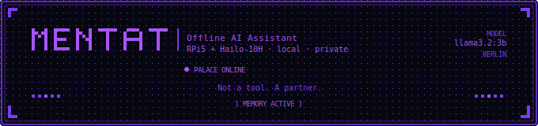
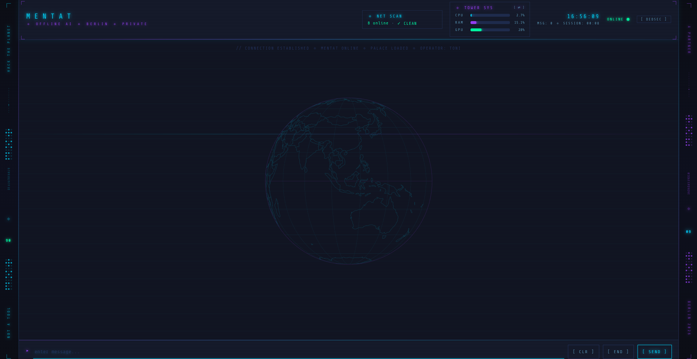
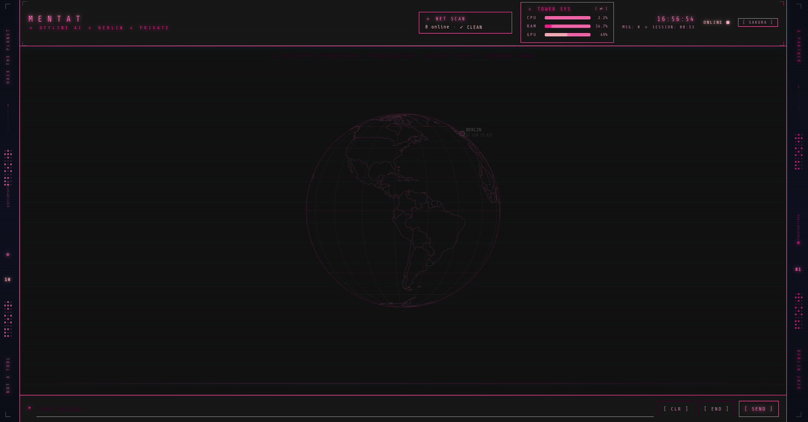

<p align="center">
  
</p>

#  Mentat — Persönlicher Offline-KI-Assistent


> *"Not a tool. A partner."*

Mentat ist ein vollständig lokal laufender, persönlicher KI-Assistent — aufgebaut auf eigener Hardware, ohne Cloud, ohne Datenweitergabe. Er läuft auf einem Raspberry Pi 5 mit Hailo-NPU als "Körper" und nutzt einen leistungsstarken Tower-PC als "Gehirn". Er hat ein persistentes Gedächtnis, kann das Web durchsuchen, sein eigenes Gedächtnis durchsuchen, hört zu und redet zurück.

---

## Warum?

Weil ich eine KI wollte, der ich vertrauen kann. Kein Modell das meine Daten an fremde Server schickt, kein schwarzes System das ich nicht verstehe. Mentat läuft auf meiner Hardware, unter meinen Regeln — und wächst mit jeder Unterhaltung.

---

## Architektur

```
mentat-ai-node (RPi5 8GB + Hailo-10H NPU)
├── MemPalace (ChromaDB + SQLite)   → persistentes Gedächtnis
├── SearXNG (Docker, Port 8888)     → private Websuche
├── hailo-ollama (Port 8000)        → llama3.2:3b für N8N Workflows
├── N8N (Docker, Port 5678)         → Automation (CVE Monitor, Network Monitor)
├── mentat.py                       → Text-Chat Interface
├── mentat-chats/                   → gespeicherte Gespräche
├── mentat-knowledge/               → Knowledge Base Dateien
└── ~/.mempalace/identity.txt       → Mentats Seele

Tower (Nobara KDE, RTX 3070)
├── Ollama (Port 11434)             → goekdenizguelmez/JOSIEFIED-Qwen3:8b-q5_k_m
├── faster-whisper (CUDA)           → Speech-to-Text
├── Piper TTS                       → Text-to-Speech
├── openwakeword                    → Hey Mentat Wakeword (in Entwicklung)
├── mentat_voice.py                 → Voice-Chat Interface
├── mentat_text.py                  → Text-Chat Interface (Tower)
└── mentat_web.py                   → Web Interface (Port 5555, Tailscale)
```

Mentat hat vier Interfaces:
- **`mentat`** — Textbasierter Chat, läuft direkt auf dem mentat-ai-node
- **`mentat-voice`** — Sprach-Chat, läuft auf dem Tower (Mikrofon + Lautsprecher)
- **`mentat-text`** — Text-Chat direkt vom Tower, selbes Palace
- **Web Interface** — Browser-basiert, erreichbar via Tailscale (Port 5555)

---

## Features

- **Persistentes Gedächtnis** — Jedes Gespräch wird ins Palace gemined und bleibt erhalten
- **Palace Tool Calling** — Mentat sucht selbstständig im eigenen Gedächtnis via `[PALACE: query]`
- **Websuche** — Mentat sucht via SearXNG wenn nötig via `[SEARCH: query]`, speichert Ergebnis ins Palace
- **Vollständig offline** — Kein einziger Request geht nach außen (außer SearXNG Suchen)
- **Sprachein- und -ausgabe** — Whisper STT + Piper TTS, läuft lokal auf der GPU
- **Wake-on-LAN** — `mentat` startet den Tower automatisch wenn er schläft
- **Auto-Save + Auto-Mine** — Jedes Gespräch wird gespeichert und automatisch ins Palace geladen
- **Zeitgefühl** — Aktuelles Datum und Uhrzeit werden automatisch bei jedem Start injiziert
- **Web Interface** — Browser-basiert via Tailscale, auch mobil nutzbar (Port 5555)

---

## Web Interface

DEDSEC-inspiriertes Browser-Frontend für Mentat. Erreichbar im Heimnetz und via Tailscale.

**Features:**
- Lock Screen mit Breach-Authentifizierung (Klick auf MENTAT-Logo startet Breach-Sequenz)
- Live System-Monitoring (CPU/RAM/GPU) für Tower, AI-Node und Kali-Pi
- Netzwerk-Monitor mit Known/Unknown Device Erkennung
- Rotierender 3D-Globus mit Standort-Marker
- 4 Themes: DEDSEC, GHOST, BREACH, SAKURA
- Palace/Web Suche mit Status-Anzeige unter Antworten
- Session-basierte Authentifizierung — Security-Keywords nur nach Breach freigeschaltet

**Setup:**
```bash
pip install flask psutil pynvml --break-system-packages

# Als systemd Service einrichten
mkdir -p ~/.config/systemd/user
cat > ~/.config/systemd/user/mentat-web.service << 'SVCEOF'
[Unit]
Description=Mentat Web Interface
After=network.target ollama.service

[Service]
ExecStart=/usr/bin/python3 /home/<YOUR_USER>/mentat_web.py
Restart=always
Environment=PATH=/home/<YOUR_USER>/.local/bin:/usr/bin:/bin

[Install]
WantedBy=default.target
SVCEOF

systemctl --user enable mentat-web
systemctl --user start mentat-web
```

Erreichbar unter:
- **Heimnetz:** `http://<TOWER_IP>:5555`
- **Unterwegs:** `http://<TOWER_TAILSCALE_IP>:5555`

> Tailscale-IP ermitteln: `tailscale ip`

---

## Screenshots

**Lock Screen — System Locked**


**Breach Authentication**


**Web Interface — DEDSEC Theme**


**Web Interface — SAKURA Theme**


---

## Tool Calling

Mentat kann zwei externe Tools selbstständig aufrufen — ohne dass ich ihn dazu auffordern muss:

| Tag | Funktion |
|-----|----------|
| `[PALACE: suchbegriff]` | Sucht im MemPalace nach Erinnerungen, Wissen, vergangenen Gesprächen |
| `[SEARCH: suchbegriff]` | Sucht im Web via SearXNG, mined Ergebnis automatisch ins Palace |

Priorität: Mentat sucht immer erst im Palace, dann im Web. Definiert in Mentats Seele via RULE 15-17.

---

## Knowledge Base Workflow

Mentat wird mit fokussiertem Wissen aus thematisch getrennten `.md` Dateien gefüttert. Jede Datei = ein Thema = bessere Chunks = bessere Suchergebnisse.

### Workflow — Neues Wissen hinzufügen

```bash
# 1. Neue .md Datei erstellen oder von außen auf den Node kopieren
scp ~/Downloads/neues_thema.md pi@<NODE_IP>:~/mentat-knowledge/

# 2. Palace init im Knowledge-Ordner (einmalig oder nach Reset)
/home/pi/.local/bin/mempalace init ~/mentat-knowledge/

# 3. Minen (nur neue Dateien werden verarbeitet)
/home/pi/.local/bin/mempalace --palace ~/mentat-palace mine ~/mentat-knowledge/ --mode projects

# 4. Suche testen
/home/pi/.local/bin/mempalace --palace ~/mentat-palace search "suchbegriff"
```

### Palace komplett resetten

```bash
rm -rf ~/mentat-palace ~/mentat-chats/*
mkdir ~/mentat-palace
/home/pi/.local/bin/mempalace init ~/mentat-palace
# Dann Knowledge Base neu minen (siehe oben)
```

### Aktuelle Knowledge Base (17 Dateien)

| Datei | Inhalt |
|-------|--------|
| 01_owasp_web_2025.md | OWASP Top 10 Web 2025 |
| 02_owasp_api_2023.md | OWASP API Security Top 10 2023 |
| 03_stgb_computerstrafrecht.md | §202a StGB, Hackerparagraph, Pentest-Recht |
| 04_netzwerktechnik.md | OSI, TCP/IP, Firewall, SPI, NAT |
| 05_linux_rechte.md | chmod, chown, SUID, Sticky Bit |
| 06_sql_datenbanken.md | SQL, Normalisierung, SQL Injection |
| 07_powershell.md | PowerShell Grundlagen, Cmdlets |
| 08_java_oop.md | Java OOP, Vererbung, PCShop Projekt |
| 09_docker.md | Docker Grundlagen, Befehle, Compose |
| 10_windows_server_ad.md | Active Directory, AD Angriffe |
| 11_pentesting_tools.md | nmap, Burp, SQLMap, Aircrack, Flipper |
| 12_mentat_system.md | Mentat Architektur, Infrastruktur |
| 13_wakeword_training.md | Hey Mentat Training, Fixes |
| 14_n8n_cve_monitor.md | N8N CVE Monitor Dokumentation |
| 15_n8n_network_monitor.md | N8N Network Monitor Dokumentation |
| 16_dvwa_brute_force.md | DVWA Brute Force mit Burp Suite |
| 17_mentat_readme.md | Mentat Projektübersicht |

---

## Setup

### 1. MemPalace installieren (mentat-ai-node)

```bash
pip install mempalace --break-system-packages
mkdir ~/mentat-palace && /home/pi/.local/bin/mempalace init ~/mentat-palace
```

### 2. SearXNG starten (mentat-ai-node)

```bash
docker run -d --name searxng --restart always \
  -p 0.0.0.0:8888:8080 \
  -e BASE_URL=http://<NODE_IP>:8888 \
  searxng/searxng:latest

docker exec searxng sh -c "printf '\nsearch:\n  formats:\n    - html\n    - json\n' >> /etc/searxng/settings.yml"
docker restart searxng
```

### 3. Ollama installieren (Tower)

```bash
curl -fsSL https://ollama.com/install.sh | sh
ollama pull goekdenizguelmez/JOSIEFIED-Qwen3:8b-q5_k_m
```

Ollama im Netzwerk erreichbar machen (`/etc/systemd/system/ollama.service.d/override.conf`):
```ini
[Service]
Environment="OLLAMA_HOST=0.0.0.0:11434"
```

### 4. Faster-Whisper + Piper (Tower)

```bash
pip install faster-whisper sounddevice soundfile openwakeword --break-system-packages
pip install nvidia-cublas-cu12 "nvidia-cudnn-cu12==9.*" --break-system-packages

# Piper
mkdir -p ~/piper && cd ~/piper
wget https://github.com/rhasspy/piper/releases/download/2023.11.14-2/piper_linux_x86_64.tar.gz
tar -xzf piper_linux_x86_64.tar.gz
wget https://huggingface.co/rhasspy/piper-voices/resolve/v1.0.0/en/en_GB/northern_english_male/medium/en_GB-northern_english_male-medium.onnx
wget https://huggingface.co/rhasspy/piper-voices/resolve/v1.0.0/en/en_GB/northern_english_male/medium/en_GB-northern_english_male-medium.onnx.json
```

### 5. SSH-Key einrichten (Tower → mentat-ai-node)

```bash
ssh-keygen -t ed25519 -f ~/.ssh/mentat_node -N ""
ssh-copy-id -i ~/.ssh/mentat_node.pub pi@<NODE_IP>
```

### 6. Aliase einrichten

```bash
# auf mentat-ai-node
echo "alias mentat='python3 ~/mentat.py'" >> ~/.bashrc

# auf Tower
echo "alias mentat-voice='python3 ~/mentat_voice.py'" >> ~/.bashrc
```

---

## Konfiguration

Variablen in `mentat.py`, `mentat_voice.py` und `mentat_web.py` anpassen:

```python
OLLAMA_URL         = "http://localhost:11434/api/chat"
SEARXNG_URL        = "http://<NODE_IP>:8888/search"
MODEL              = "goekdenizguelmez/JOSIEFIED-Qwen3:8b-q5_k_m"
SSH_KEY            = "/home/<YOUR_USER>/.ssh/mentat_node"
NODE_IP            = "<YOUR_NODE_USER>@<NODE_IP>"
NODE_CHATS         = "/home/<YOUR_NODE_USER>/mentat-chats"
NODE_PALACE        = "/home/<YOUR_NODE_USER>/mentat-palace"
MEMPALACE_BIN      = "/home/<YOUR_NODE_USER>/.local/bin/mempalace"
TOWER_IP           = "<TOWER_IP>"
TOWER_MAC          = "<TOWER_MAC>"        # für Wake-on-LAN
MIC_DEVICE         = 0                    # prüfen: python3 -c "import sounddevice; print(sounddevice.query_devices())"
MIC_SAMPLERATE     = 48000
WAKEWORD_MODEL     = "/path/to/hey_mentat.onnx"
WAKEWORD_THRESHOLD = 0.5
```

---

## Die Seele

Mentats Persönlichkeit liegt in `~/.mempalace/identity.txt` auf dem mentat-ai-node. Diese Datei wird bei jedem Start als System-Prompt geladen.

Enthält: Wer Mentat ist, wen er dient, wie er sich verhält, und welche Tools er nutzen darf (RULE 15-17 für PALACE/SEARCH Tool Calling).

> ⚠️ Keine echten IPs, Passwörter oder sensiblen Daten in die Seele schreiben.

---

## Changelog

### v2.0 — April 2026

**Web Interface komplett überarbeitet:**

- **Lock Screen** — Beim Laden erscheint ein roter blinkender Fullscreen `// SYSTEM LOCKED`. Klick auf das MENTAT-Logo startet die Breach-Sequenz. Schützt vor ungewolltem Zugriff, startet bei jedem Reload neu.
- **Breach Authentifizierung** — DEDSEC-Style Sequenz mit 4 Fortschrittsbalken (FIREWALL, ENCRYPTION, AUTH, ROOT). Nur nach erfolgreichem Breach ist der Operator authentifiziert und Security-Keywords sind freigeschaltet.
- **Session-basierte Auth** — Security-Keywords (pentest, exploit, nmap usw.) werden ohne Breach im Python-Backend geblockt, bevor sie Ollama erreichen. Filter-Bypass durch Umformulierung möglich — bewusste Designentscheidung für Lernumgebung.
- **System Monitoring** — Live CPU/RAM/GPU Anzeige für alle drei Nodes. Umschaltbar per `[ ⇄ ]` Button direkt im Header.
- **Netzwerk Monitor** — Known/Unknown Device Erkennung mit Warnanzeige. Daten vom letzten Nmap-Scan auf dem AI-Node.
- **Multi-Theme** — DEDSEC (blau/lila), GHOST (grün), BREACH (rot), SAKURA (pink). Wird im localStorage gespeichert.
- **Globe Background** — Rotierender 3D-Globus mit Länder-Outlines, konfigurierbarem Standort-Marker.
- **Palace/Web Status** — Unter Mentats Antworten wird angezeigt ob er im Palace oder Web gesucht hat.
- **Ollama Timeout** — Von 120s auf 180s erhöht (3 Versuche × 60s) für stabilere Antworten unter Last.
- **Modell gewechselt** — Von `llama3.1:8b` auf `goekdenizguelmez/JOSIEFIED-Qwen3:8b-q5_k_m` (abliteriert, kein Safety-Filter, stärker für Security-Themen).

### Bekannte Bugs / TODOs

- Nach `[ END ]` wird der Lock Screen nicht wieder angezeigt — nur bei Seiten-Reload
- Bei langen Sessions (50+ Context-Token) beginnt das Modell zu halluzinieren/loopen — kein `max_tokens` Limit gesetzt
- `[PALACE:]` / `[WEB:]` Status Tag ist visuell zu unscheinbar — Verbesserung geplant

---

## Troubleshooting

### Lock Screen erscheint nicht
```bash
# Browser-Cache leeren
Strg + Shift + R

# Oder localStorage manuell löschen
# F12 → Application → Local Storage → mentat-auth entfernen
```

### "Authentication required" mitten in der Session
- `authenticated_sessions` lebt nur im RAM — nach Flask-Neustart verloren
- Fix: Seite neu laden → Breach erneut durchführen
```bash
systemctl --user status mentat-web   # Service-Status prüfen
systemctl --user restart mentat-web  # Neustart falls nötig
```

### Mentat antwortet nicht / Timeout
```bash
systemctl status ollama              # Ollama läuft?
ping <TOWER_IP>                      # Tower erreichbar?
wol <TOWER_MAC>                      # Tower aufwecken (WoL)
ollama list                          # Modell geladen?
ollama pull goekdenizguelmez/JOSIEFIED-Qwen3:8b-q5_k_m  # Modell neu laden
```

### Palace Suche liefert nichts
```bash
ssh -i ~/.ssh/mentat_node <NODE_USER>@<NODE_IP>   # SSH-Verbindung testen
which mempalace                                    # MemPalace installiert?
ls ~/mentat-palace                                 # Palace initialisiert?
mempalace --palace ~/mentat-palace search "test"  # Suche testen
```

### Netzwerk Box zeigt "-- offline"
```bash
ssh <NODE_USER>@<NODE_IP> "cat /tmp/last_scan.json"   # Letzter Scan vorhanden?
# N8N Network Monitor im Dashboard prüfen → http://<NODE_IP>:5678
```

---

## Wakeword — Hey Mentat

Custom Wakeword via [openwakeword-trainer](https://github.com/lgpearson1771/openwakeword-trainer).

**Status:** Modell vorhanden (`~/openwakeword-trainer/export/hey_mentat.onnx`), Score ~0.81, Threshold 0.5. Noch nicht in `mentat_voice.py` integriert.  
**Plan:** Integration + 20-50 echte Stimm-Samples für stabileres Training.

```bash
cd ~/openwakeword-trainer
source venv/bin/activate   # Python 3.10 venv — nicht System-Python!
python train_wakeword.py --config configs/hey_mentat.yaml
python train_wakeword.py --config configs/hey_mentat.yaml --from <schritt>  # Resume
```

---

## Roadmap

- [x] Tool Calling: Mentat sucht selbst im Palace via `[PALACE:]`
- [x] Web Interface mit Breach-Authentifizierung
- [x] Live System-Monitoring für alle Nodes
- [x] Netzwerk-Monitor mit Known/Unknown Erkennung
- [ ] Wakeword "Hey Mentat" in mentat_voice.py integrieren
- [ ] Nach `[ END ]` Lock Screen wieder anzeigen
- [ ] `max_tokens` Limit setzen gegen Context-Overflow Loop
- [ ] Wöchentlicher Kontext-Refresh via N8N + Telegram
- [ ] Dokument-Mining: PDFs/Schulunterlagen ins Palace

---

## Tech Stack

`JOSIEFIED-Qwen3:8b` `Ollama` `Flask` `MemPalace` `ChromaDB` `SearXNG` `faster-whisper` `Piper TTS` `openwakeword` `Docker` `N8N` `Raspberry Pi 5` `Hailo-10H` `Wake-on-LAN` `Tailscale`
