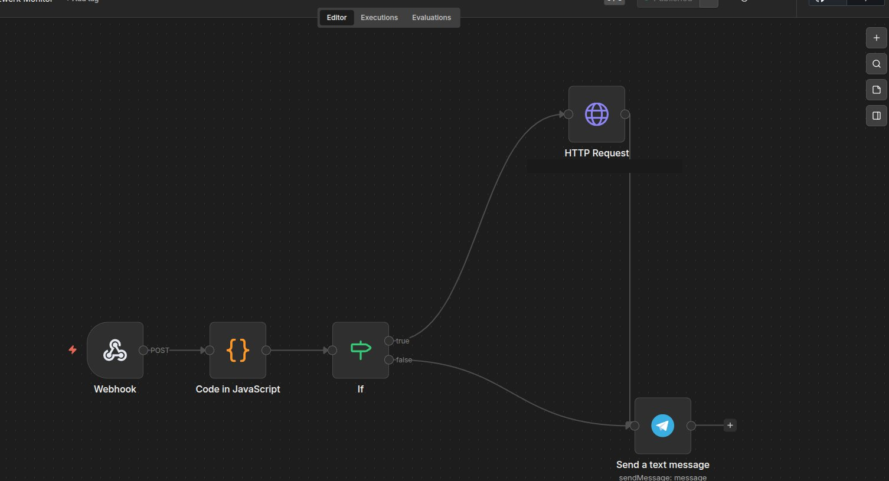

# Mentat Network Monitor


Automatischer Heimnetzwerk-Monitor der alle 8h einen nmap + arp-scan durchführt, Geräte gegen eine Whitelist prüft und einen Bericht via Telegram meldet.

---

## Workflow




**Pipeline:**
`Cron Job (Pi)` → `scan.sh` → `Webhook (N8N)` → `Code in JavaScript (Whitelist-Check + Nachricht)` → `IF` → `HTTP Request (Ollama)` → `Send a text message (Telegram)`

---

## Infrastruktur

| Komponente | Details |
|------------|---------|
| N8N | Docker Container auf `mentat-ai-node` |
| hailo-ollama | Nativer Prozess auf Pi, Port 8000, Hailo-8 NPU |
| Modell | `llama3.2:3b` |
| nmap | Nativ auf Pi installiert |
| arp-scan | Nativ auf Pi installiert |

---

## Dateien auf dem Pi

| Pfad | Beschreibung |
|------|-------------|
| `/etc/network-monitor/scan.sh` | Bash Script — führt Scans aus, schickt an Webhook |
| `/etc/network-monitor/whitelist.json` | Liste bekannter Geräte (IP + MAC + Name) |

---

## scan.sh

```bash
#!/bin/bash

WHITELIST="/etc/network-monitor/whitelist.json"
WEBHOOK="http://localhost:5678/webhook/network-scan"

NMAP_OUT=$(sudo /usr/bin/nmap -sn 192.168.x.0/24 2>/dev/null)
ARP_OUT=$(sudo /usr/sbin/arp-scan --localnet --retry=3 2>/dev/null)

DEVICES=$(echo "$ARP_OUT" | grep -E "^192\." | awk '{print $1, $2}' | sort -u)

JSON="["
FIRST=true

while IFS= read -r line; do
  IP=$(echo "$line" | awk '{print $1}')
  MAC=$(echo "$line" | awk '{print $2}')

  KNOWN=$(python3 -c "
import json, sys
wl = json.load(open('$WHITELIST'))
for d in wl:
    if d['mac'].lower() == '$MAC'.lower():
        print(d['name'])
        sys.exit()
print('UNKNOWN')
")

  if [ "$FIRST" = true ]; then
    FIRST=false
  else
    JSON="$JSON,"
  fi

  JSON="$JSON{\"ip\":\"$IP\",\"mac\":\"$MAC\",\"name\":\"$KNOWN\",\"known\":$([ \"$KNOWN\" = \"UNKNOWN\" ] && echo false || echo true)}"

done <<< "$DEVICES"

JSON="$JSON]"

curl -s -X POST "$WEBHOOK" \
  -H "Content-Type: application/json" \
  -d "{\"devices\":$JSON,\"timestamp\":\"$(date -Iseconds)\"}"
```

> `sort -u` verhindert doppelte Einträge bei arp-scan DUP-Meldungen.

---

## whitelist.json

```json
[
  {"ip": "192.168.x.1", "mac": "xx:xx:xx:xx:xx:xx", "name": "Router"},
  {"ip": "192.168.x.2", "mac": "xx:xx:xx:xx:xx:xx", "name": "ToniPC"},
  {"ip": "192.168.x.3", "mac": "xx:xx:xx:xx:xx:xx", "name": "Kali-LAN"},
  {"ip": "192.168.x.4", "mac": "xx:xx:xx:xx:xx:xx", "name": "mentat-ai-node"},
  {"ip": "192.168.x.5", "mac": "xx:xx:xx:xx:xx:xx", "name": "Kali-WLAN"},
  {"ip": "192.168.x.6", "mac": "xx:xx:xx:xx:xx:xx", "name": "iPhone-Toni"},
  {"ip": "192.168.x.7", "mac": "xx:xx:xx:xx:xx:xx", "name": "iPhone-Frau"},
  {"ip": "192.168.x.8", "mac": "xx:xx:xx:xx:xx:xx", "name": "Apple-TV"}
]
```

> ⚠️ MACs wurden aus Sicherheitsgründen entfernt.

---

## Code in JavaScript — Whitelist-Check & Nachricht

Bei bekannten Geräten wird die Telegram-Nachricht direkt gebaut. Bei unbekannten Geräten werden IP und MAC für Ollama aufbereitet — ohne Sonderzeichen die JSON kaputtmachen könnten.

```javascript
const body = $input.first().json.body;
const devices = body.devices || [];
const timestamp = body.timestamp;

const date = new Date(timestamp);
const formatted = date.toLocaleString('de-DE', {
  timeZone: 'Europe/Berlin',
  day: '2-digit', month: '2-digit', year: 'numeric',
  hour: '2-digit', minute: '2-digit'
});

const known = devices.filter(d => d.known === true);
const unknown = devices.filter(d => d.known === false);

if (unknown.length === 0) {
  const deviceList = known.map(d => `✓ ${d.name}`).join('\n');
  return [{
    json: {
      has_unknown: false,
      message: `🟢 Netzwerk-Scan — ${formatted}\n\n${known.length} Geraete online, alle bekannt.\n\n${deviceList}`
    }
  }];
}

const unknownList = unknown.map(d => {
  const mac = d.mac.replace(/:/g, '-');
  return `IP ${d.ip} MAC ${mac}`;
}).join(' und ');

return [{
  json: {
    has_unknown: true,
    unknown_count: unknown.length,
    known_count: known.length,
    timestamp: formatted,
    unknown_details: unknownList
  }
}];
```

---

## IF — Bekannt oder Unbekannt

- `{{ $json.has_unknown }}` is equal to `true`
- Convert types where required: **an**
- **true** → Ollama bewertet das unbekannte Gerät → Telegram
- **false** → direkt Telegram mit fertigem Bericht (kein LLM-Call)

---

## Ollama Prompt — nur bei unbekannten Geräten

```json
{
  "model": "llama3.2:3b",
  "messages": [
    {
      "role": "system",
      "content": "Du bist ein Netzwerk-Assistent. Antworte NUR auf Deutsch. Maximal 2 Saetze. Keine Vermutungen. Nur Fakten."
    },
    {
      "role": "user",
      "content": "Ein unbekanntes Geraet ist in meinem Heimnetz: {{ $json.unknown_details }}. Gefunden um {{ $json.timestamp }}. Fasse nur die Fakten zusammen."
    }
  ],
  "stream": false
}
```

---

## Telegram

- **True Pfad (Warnung):** `🔴 Unbekanntes Gerät!` + echter Zeilenumbruch + `{{ $json.message?.content }}`
- **False Pfad (OK):** `{{ $json.message }}`

---

## Cron Job

```
0 0,8,16 * * * /bin/bash /etc/network-monitor/scan.sh
```

Läuft täglich um **00:00, 08:00, 16:00 Uhr**.

---

## Verhalten

| Situation | Verhalten |
|-----------|-----------|
| Alle Geräte bekannt | Direkte Telegram Nachricht mit Geräteliste — kein LLM |
| Unbekanntes Gerät | Ollama bewertet → Telegram Warnung mit IP + MAC |

---

## Changelog

### v2.0 — 04.04.2026 (aktuell)
- Modell gewechselt: `qwen2.5-instruct:1.5b` → `llama3.2:3b` — bessere Qualität
- `sort -u` in scan.sh → keine doppelten Geräte / kein Kontext-Overflow mehr
- MAC Doppelpunkte durch Bindestriche ersetzt → kein JSON-Fehler mehr
- `unknown_details` ohne Sonderzeichen und Zeilenumbrüche
- Echter Zeilenumbruch in Telegram Text Feld → saubere Formatierung

### v1.1 — 03.04.2026
- Ollama nur bei unbekannten Geräten aufgerufen
- Bei bekannten Geräten direkte Telegram Nachricht mit Geräteliste und Uhrzeit
- IP und MAC des unbekannten Geräts direkt in Telegram sichtbar
- Keine Halluzination mehr bei normalem Scan

### v1.0 — 03.04.2026
- Initialer Aufbau
- nmap + arp-scan via Bash Script
- Whitelist-Check in N8N Code Node
- Ollama Zusammenfassung auf Deutsch
- Cron Job alle 8h
