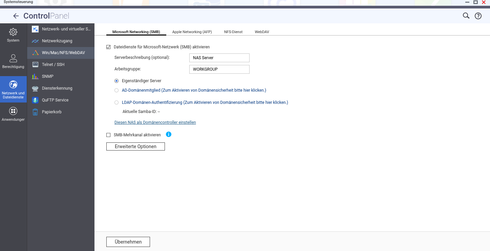
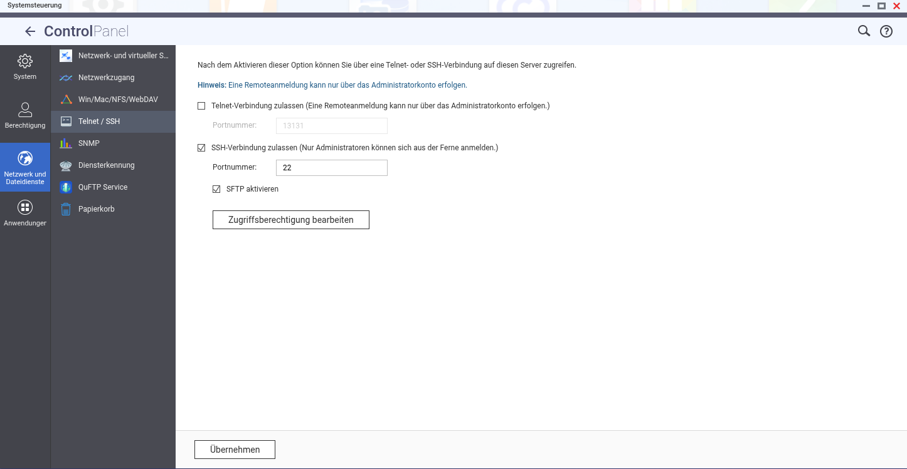
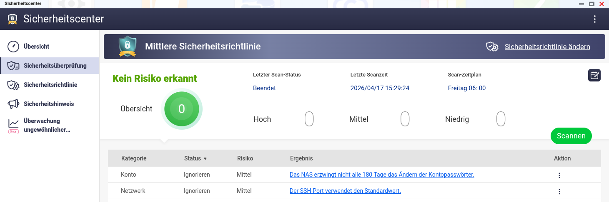
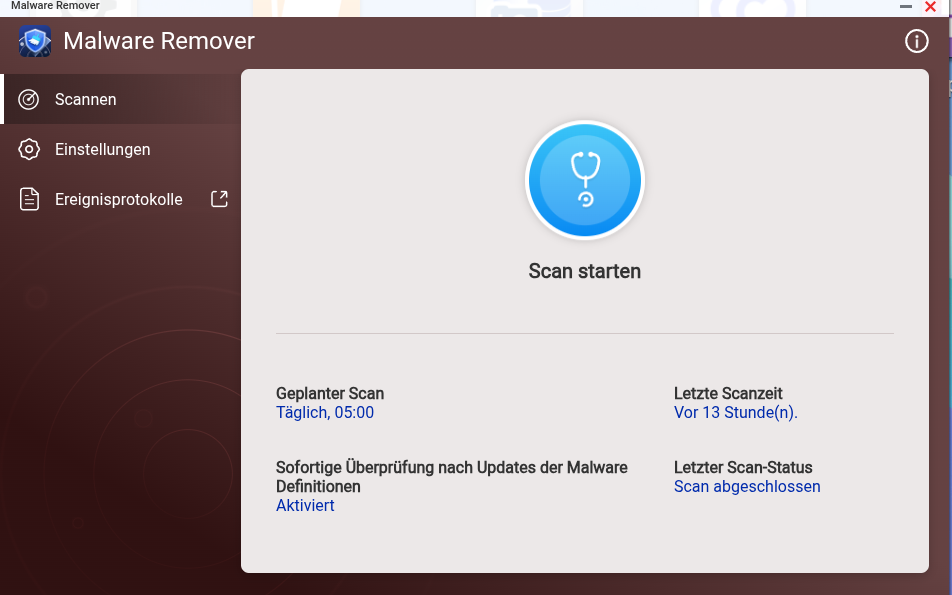

# QNAP TS-216G — Homelab Backup System

Dieses Projekt dokumentiert den vollständigen Aufbau eines NAS-basierten Backup-Systems für ein Homelab mit drei Geräten (Tower, Kali-Pi, mentat-ai-node). Inklusive automatischer Backups per rsync, Wake-on-LAN, Snapshot-Schutz und Ransomware-Erkennung.

---

## Hardware

| Komponente | Details |
|---|---|
| NAS | QNAP TS-216G |
| CPU | ARM Cortex-A55 Quad-Core 2.0GHz |
| RAM | 4GB DDR4 |
| LAN | 1x 2.5GbE, 1x 1GbE |
| Festplatten | 2x 2TB WD Red Plus CMR (WD20EFPX) |
| RAID | RAID 1 (Mirror) |

> **Warum WD Red Plus CMR?** CMR (Conventional Magnetic Recording) ist stabiler als SMR bei NAS-Dauerbetrieb und RAID-Rebuilds. Immer CMR-Platten für NAS verwenden.

---

## Netzwerk

| Gerät | Hostname | IP |
|---|---|---|
| Router | router | <RUTER_IP> |
| Tower | `<TOWER_HOSTNAME>` | <TOWER_IP> |
| Kali-Pi | `<KALI_HOSTNAME>` | <KALI_IP> |
| mentat-ai-node | `<NODE_HOSTNAME>` | <ai_node_IP> |
| NAS | MentatVault | <NAS_IP> |

> Echte Hostnamen werden hier nicht dokumentiert. IPs an das eigene Heimnetz anpassen.  
> Der NAS hat eine feste DHCP-Reservierung im Router (MAC-Adresse im Router hinterlegt).

---

## QTS Konfiguration

- **QTS Version:** 5.2.9.3451
- **Hostname:** MentatVault
- **Webinterface:** `http://<NAS_IP>:8080`
- **SSH:** Port 22, aktiviert, SFTP aktiviert
- **SMB:** aktiviert, Workgroup: WORKGROUP
- **Telnet:** deaktiviert




---

## Speicher

- **Speicherpool:** Speicherpool 1, RAID 1, 1.81TB nutzbar
- **Volume:** MentatVault (Thin-Volume)
- **Snapshot:** täglich 01:00 Uhr automatisch, 20% reserviert, Intelligente Versionierung
- **Warnschwellenwert:** 80%

> **RAID 1 ≠ Backup:**  
> RAID 1 spiegelt Daten in Echtzeit auf beide Platten — stirbt eine Platte, läuft der NAS weiter.  
> RAID schützt aber **nicht** vor versehentlichem Löschen. Eine gelöschte Datei verschwindet sofort von beiden Platten.  
> Die rsync-Skripte in diesem Projekt sind die eigentliche Datensicherung. Snapshots fangen versehentliches Löschen ab.

---

## Freigabeordner

| Ordner | Volume | Zweck |
|---|---|---|
| backup | MentatVault | Homelab Backups |
| Public | MentatVault | Standard (ungenutzt) |

---

## Backup-Struktur auf dem NAS

```
/backup/
├── tower/
│   └── home/             # /home/<USER>/ vom Tower
├── mentat-ai-node/
│   ├── mentat-palace/    # ChromaDB MemPalace
│   ├── mentat-chats/     # Chat-Historie
│   ├── mentat-knowledge/ # Knowledge Base
│   ├── mentat.py         # Hauptskript
│   ├── n8n/              # N8N Workflow Exports (JSON)
│   └── identity.txt      # Mentat Identity/Soul
└── kali-pi/
    ├── home/             # /home/kali/ (ohne .cache/)
    └── apache2/          # Apache/DVWA Konfiguration (ohne Symlinks)
```

---

## Backup-Skripte

Alle Skripte liegen auf dem **Tower** unter `~/`. Der Tower ist der Initiator — er verbindet sich per SSH zu den Pis und zieht die Daten auf den NAS.

### backup-tower.sh

```bash
#!/bin/bash
# Backup Tower -> MentatVault
# Sichert das Home-Verzeichnis des Towers auf den NAS per rsync über CIFS-Mount.
#
# Voraussetzungen:
#   - NAS unter /mnt/mentatvault gemountet (siehe fstab)
#   - Skript ausführbar: chmod +x backup-tower.sh

DATUM=$(date +%Y-%m-%d)
ZIEL="/mnt/mentatvault/tower"       # Zielpfad auf dem NAS
LOG="$HOME/backup-tower.log"        # Logdatei

echo "[$DATUM] Backup gestartet" >> $LOG

rsync -avz --delete \
  --exclude='.local/share/Steam/' \  # Spiele nicht sichern (neu installierbar)
  --exclude='.cache/' \              # Cache nicht sichern
  --exclude='Downloads/' \           # Downloads nicht sichern
  /home/<USER>/ \                    # Quelle: Home-Verzeichnis
  $ZIEL/home/ >> $LOG 2>&1           # Ziel: NAS, alles ins Log schreiben

echo "[$DATUM] Backup abgeschlossen" >> $LOG
```

**Erklärung der rsync-Flags:**

| Flag | Bedeutung |
|---|---|
| `-a` | Archive: behält Rechte, Timestamps, Symlinks |
| `-v` | Verbose: zeigt übertragene Dateien |
| `-z` | Komprimierung während der Übertragung |
| `--delete` | Löscht auf dem Ziel was auf der Quelle nicht mehr existiert |
| `--exclude` | Schließt Verzeichnisse vom Backup aus |

> Das erste Backup überträgt alles (kann Stunden dauern). Ab dem zweiten Lauf überträgt rsync nur Änderungen — das dauert dann Sekunden bis wenige Minuten.

### backup-mentat.sh

```bash
#!/bin/bash
# Backup mentat-ai-node -> MentatVault
DATUM=$(date +%Y-%m-%d)
ZIEL="/mnt/mentatvault/mentat-ai-node"
LOG="$HOME/backup-mentat.log"

echo "[$DATUM] Backup gestartet" >> $LOG

rsync -avz --delete pi@<NODE_IP>:/home/pi/mentat-palace/ $ZIEL/mentat-palace/ >> $LOG 2>&1
rsync -avz --delete pi@<NODE_IP>:/home/pi/mentat-chats/ $ZIEL/mentat-chats/ >> $LOG 2>&1
rsync -avz pi@<NODE_IP>:/home/pi/mentat.py $ZIEL/ >> $LOG 2>&1
rsync -avz --delete pi@<NODE_IP>:/home/pi/mentat-knowledge/ $ZIEL/mentat-knowledge/ >> $LOG 2>&1

# N8N: Docker-Volume nicht direkt lesbar, Export über docker exec
ssh pi@<NODE_IP> "mkdir -p /home/pi/n8n-backup && docker exec n8n sh -c 'n8n export:workflow --backup --output=/tmp/n8n-backup/' && docker cp n8n:/tmp/n8n-backup/. /home/pi/n8n-backup/" >> $LOG 2>&1
rsync -avz --delete pi@<NODE_IP>:/home/pi/n8n-backup/ $ZIEL/n8n/ >> $LOG 2>&1

rsync -avz pi@<NODE_IP>:/home/pi/.mempalace/identity.txt $ZIEL/ >> $LOG 2>&1

echo "[$DATUM] Backup abgeschlossen" >> $LOG
```

### backup-kali.sh

```bash
#!/bin/bash
# Backup Kali-Pi -> MentatVault
DATUM=$(date +%Y-%m-%d)
ZIEL="/mnt/mentatvault/kali-pi"
LOG="$HOME/backup-kali.log"

echo "[$DATUM] Backup gestartet" >> $LOG

rsync -avz --delete \
  --exclude='.cache/' \
  kali@<KALI_IP>:/home/kali/ $ZIEL/home/ >> $LOG 2>&1

# --no-links weil CIFS keine Linux-Symlinks unterstützt
rsync -avz --delete --no-links kali@<KALI_IP>:/etc/apache2/ $ZIEL/apache2/ >> $LOG 2>&1

echo "[$DATUM] Backup abgeschlossen" >> $LOG
```

---

## Cronjobs

### Tower (crontab -e)

```
# MentatVault Backups
0 2 * * * /home/<USER>/backup-tower.sh    # täglich 02:00
0 3 * * * /home/<USER>/backup-mentat.sh   # täglich 03:00
5 4 * * 0 /home/<USER>/backup-kali.sh     # wöchentlich Sonntag 04:05
30 4 * * * sudo shutdown -h now           # Tower schläft nach Backups
```

### mentat-ai-node (crontab -e)

```
# Tower aufwecken vor Backups
50 1 * * * wakeonlan <TOWER_MAC>
```

**Cron-Syntax:**
```
MIN STD TAG MON WOCHENTAG BEFEHL
 0   2   *   *      *      = täglich um 02:00
 0   4   *   *      0      = jeden Sonntag um 04:00
```

**Ablauf nachts:**

| Zeit | Gerät | Aktion |
|---|---|---|
| 01:50 | mentat-ai-node | WoL — weckt Tower per Magic Packet |
| 02:00 | Tower | backup-tower.sh |
| 03:00 | Tower | backup-mentat.sh |
| 04:05 | Tower | backup-kali.sh (nur Sonntags) |
| 04:30 | Tower | shutdown |
| 05:00 | NAS | Malware Remover Scan |

---

## fstab Eintrag (Tower)

```
//<NAS_IP>/backup /mnt/mentatvault cifs credentials=/etc/samba/credentials_nas,iocharset=utf8,vers=3.0,nofail,uid=1000,gid=1000,file_mode=0770,dir_mode=0770 0 0
```

Credentials-Datei `/etc/samba/credentials_nas`:
```
username=<NAS_USER>
password=<NAS_PASSWORD>
```

```bash
sudo chmod 600 /etc/samba/credentials_nas  # Nur Owner darf lesen
```

---

## SSH-Keys für automatische Backups

```bash
# Key generieren (einmalig auf dem Tower)
ssh-keygen -t ed25519 -C "tower-backup"

# Key auf Kali-Pi hinterlegen
ssh-copy-id kali@<KALI_IP>

# Key auf mentat-ai-node hinterlegen
ssh-copy-id pi@<NODE_IP>
```

---

## Wake-on-LAN (Tower)

Der Tower ist nachts ausgeschaltet. Der mentat-ai-node weckt ihn automatisch vor den Backups.

**BIOS (Gigabyte B660M Gaming):**
- Settings → Power Management → ErP → Deaktiviert

**Nobara (systemd Service):**

```ini
# /etc/systemd/system/wol.service
[Unit]
Description=Wake-on-LAN for enp4s0
After=network.target

[Service]
Type=oneshot
ExecStart=/usr/sbin/ethtool -s enp4s0 wol g
RemainAfterExit=yes

[Install]
WantedBy=multi-user.target
```

```bash
sudo systemctl enable wol.service
sudo systemctl start wol.service
```

**mentat-ai-node Alias** (`~/.bashrc`):
```bash
alias tower-on="wakeonlan <TOWER_MAC>"
```

---

## N8N Backup (Docker)

N8N läuft als Docker-Container. Da `/var/lib/docker/volumes/` Root-Rechte benötigt, wird der Export über `docker exec` + `docker cp` gemacht:

```bash
# Workflows aus Container exportieren
docker exec n8n sh -c 'n8n export:workflow --backup --output=/tmp/n8n-backup/'

# Aus Container auf Host kopieren
docker cp n8n:/tmp/n8n-backup/. /home/pi/n8n-backup/

# Von Host auf NAS synchronisieren
rsync -avz --delete pi@<NODE_IP>:/home/pi/n8n-backup/ /mnt/mentatvault/mentat-ai-node/n8n/
```

---

## Sicherheit

### Übersicht

- Admin-Account auf NAS deaktiviert ✅
- SSH aktiviert (Port 22), Telnet deaktiviert ✅
- NAS **nicht** in Tailscale — nur lokal erreichbar ✅
- Keine Cloud-Anbindung (myQNAPcloud deaktiviert) ✅
- QTS 5.2.9 — aktuellste Firmware ✅

### Fernzugriff auf NAS

Der NAS ist nicht direkt per Tailscale erreichbar. Zugriff von außen über SSH-Jump:

```bash
ssh -J pi@<NODE_TAILSCALE_IP> <NAS_USER>@<NAS_IP>
```

### Snapshot-Schutz

Tägliche Snapshots um 01:00 Uhr mit garantiertem Speicherplatz (20% reserviert). Bei versehentlichem Löschen kann jeder Stand wiederhergestellt werden.

### Sicherheitscenter (QTS 5.2)

Mittlere Sicherheitsrichtlinie aktiv. Wöchentlicher Sicherheitsscan (Freitag 06:00).



**Überwachung ungewöhnlicher Dateiaktivitäten (Beta):**
- Erkennt ungewöhnlich viele Dateiänderungen automatisch
- Kann Volume auf Read-Only setzen bei Ransomware-Verdacht
- Baseline-Erstellung dauert 7 Tage nach Aktivierung

### Malware Remover

Täglich 05:00 Uhr — nach Abschluss aller Backups.



---

## Geplante Erweiterungen

- N8N Workflow: Telegram-Benachrichtigung bei neuem Firmware-Update
- N8N Workflow: Telegram-Benachrichtigung bei Malware-Fund
- Separater Backup-User mit eingeschränkten Rechten (nur Schreiben in `/backup`)
